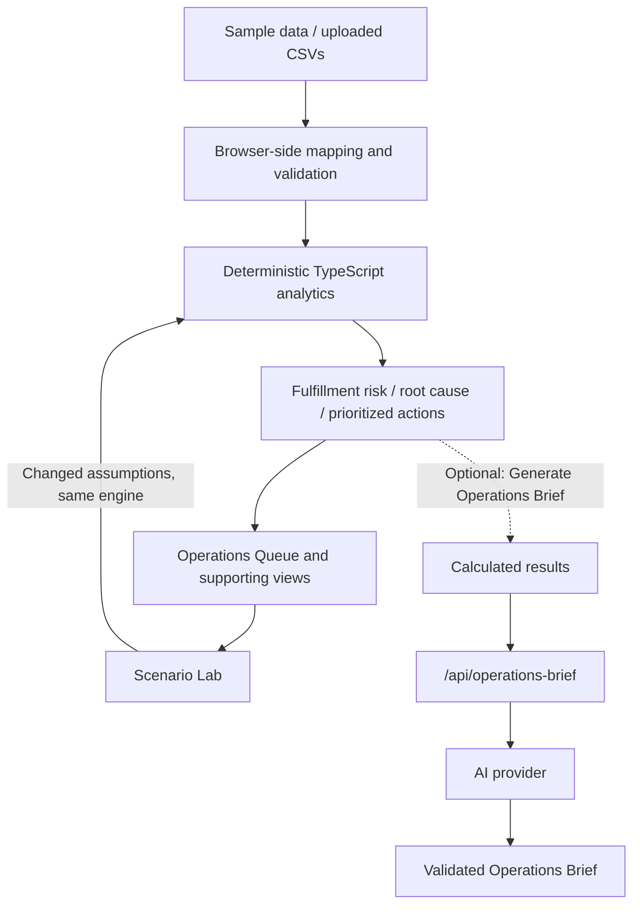

# Freight Fulfillment Intelligence

A freight marketplace can have enough physical trucks and still struggle to fulfill demand. Carrier rates, acceptance, service reliability and concentration all affect how much capacity is realistically usable.

**Live demo:** [https://freight.esmailarshad.com](https://freight.esmailarshad.com)

**The core question: Where is fulfillment at risk, why, and what should Operations do?**

## What it does

- **Operations Queue:** prioritizes capacity, pricing, service, commercial and carrier actions alongside fulfillment and revenue exposure.
- **Capacity & Fulfillment:** compares demand with qualified and effective capacity by lane, equipment and pickup date, with filters and carrier drilldowns.
- **Pricing & Economics:** shows accepted-rate benchmarks and modeled rate scenarios, including acceptance, coverage and gross take-rate impact.
- **Supply Gaps:** ranks where recurring shortfalls justify deeper carrier supply.
- **Scenario Lab:** compares changed assumptions with the baseline using the same decision engine.

Decisions and supporting figures remain inspectable. The application starts with synthetic data and can analyze your own CSVs. Detailed carrier blocks, benchmark confidence, validation warnings and score components are available through expandable sections.

## How the decision engine works

CSV validation → deterministic analytics → fulfillment and commercial risk → root cause → prioritized actions → scenario testing → optional AI narration.

Analytics are pure TypeScript functions in `src/analytics/`. Qualified physical capacity is adjusted for historical rate acceptance and service reliability. The engine applies explicit sample guards and fallback hierarchies, classifies root causes and generates recommendations from fixed rules. Concentration aggregates every qualified capacity block belonging to the same carrier.

**Gross take-rate proxy** is a planning measure of gross spread, not realized profit or a marketplace's accounting definition. **Modeled revenue exposure** is not lost revenue. Historical rate/acceptance relationships are empirical, not causal or machine learning.

The [product specification](docs/freight_marketplace_fulfillment_capacity_v1_spec.md) contains the formulas, data contracts and default thresholds. No AI participates in calculations, classification, prioritization or scenarios.

## Architecture & AI boundaries



**Where AI fits:** Fulfillment risk, root causes and recommended actions need to remain repeatable and inspectable. Deterministic code handles the calculations, risk classification, root causes, action priorities and scenarios. AI is only used to turn those calculated results into a short Operations Brief.

## Core decisions

| Operating problem | Response |
| --- | --- |
| Physical supply shortage | Secure additional qualified capacity; price alone cannot close the gap. |
| Pricing competitiveness | Review the lowest modeled buy-rate increase that improves coverage within the commercial floor. |
| Service-quality drag | Favor reliable alternate capacity. |
| Commercial constraint | Escalate the service/pricing trade-off when restoring coverage breaches the floor. |
| Carrier concentration | Activate backup supply without misrepresenting healthy coverage as a fulfillment crisis. |
| Demand spike | Pre-book incremental capacity against the historical weekly baseline. |

Optional carrier payments add an exposure review only. Payment status never changes acceptance, reliability or capacity.

## Scenario Lab

Adjust demand, carrier capacity, carrier buy rates, maximum deadhead, minimum reliability and the commercial floor. An optional lane/equipment override applies after the global adjustments.

Baseline and scenario results come from `runScenario()` and the same `analyze()` engine. New, resolved and changed-severity actions remain inspectable. Other tabs retain the baseline; **Reset Scenario** restores defaults. Scenario quantities retain fractional load-equivalents internally.

## Using your own data

Choose **Upload data**, then **Upload → Map columns → Validate → Analyze**.

**Download CSV templates** in the app provides five CSVs with canonical headers and synthetic examples (carrier payments optional); replace the example rows and dates with your own. Maintainers can regenerate the static ZIP from the schemas with `npm run generate:templates` (requires the system `zip` utility).

| Upload slot | Required | Contents |
| --- | --- | --- |
| Upcoming loads | Yes | Future demand, pickup times, equipment and sell/planned buy rates |
| Carrier capacity | Yes | Additive capacity blocks for a carrier, lane, equipment and date |
| Historical loads | Yes | Execution history and service outcomes |
| Historical offers | Yes | Observed offered rates and acceptance |
| Carrier payments | No | Carrier-level payable exposure |

Any `.csv` filename works. Unique normalized header matches and controlled synonyms are selected automatically. Resolve ambiguous required mappings; optional fields may remain unmapped. A column cannot map to two fields. Lane can be computed from origin and destination where permitted by the schema.

Blocking errors prevent analysis. Warnings do not. Past-due upcoming loads and future historical loads/offers remain visible but are excluded from analytics. Missing payments makes payment exposure actions unavailable. All monetary rows must use one currency; there is no FX conversion.

Validation captures a fixed analysis timestamp. Uploaded dates are never shifted. **Manage uploaded data** retains files and mappings; editing or replacing them invalidates old results. **Reset to sample data** clears uploads and reloads the sample. Refresh clears session state.

## Data privacy

CSV parsing, validation, analytics and scenarios run in the browser. Files are not uploaded or stored. There is no database, localStorage, IndexedDB, cookie or account system. Uploaded and sample data never mix.

**Generate Operations Brief** is optional. Only calculated results are sent to the AI provider. Your CSV files stay in your browser. An explicit click sends the allowlisted summary to `/api/operations-brief`. The summary includes headline KPIs and at most five items per action, risk, demand-spike, concentration and supply-priority list. It can contain lane/equipment labels and recommendation text, but never raw CSV contents, complete source records, benchmark offer rows or individual capacity blocks.

An allowlisted payload builder selects every field explicitly. The endpoint rejects unknown fields, raw dataset shapes, oversized bodies and excessive arrays. A status-only GET checks availability without transmitting analysis. Credentials stay on the server. Responses are not cached, and application code does not log or persist operational context or briefs. The chosen provider's data-handling policy still applies to the summary it receives.

The brief has exactly four sections and fewer than 250 words. Format and numerical-token checks reject unsupported output. These checks do not prove the factual meaning of generated prose; review narration alongside the deterministic queue. Provider failures leave analytics fully usable.

## Sample data

The sample is entirely synthetic and does not represent any company's network or operations. Seed 42 reproduces 1,200 historical loads, 3,840 offers, 155 upcoming load-equivalents, 48 carriers, 12 lanes, five equipment types, seven customers and four business units. Twelve carriers operate across multiple lanes.

Planted scenarios cover port demand growth and pricing pressure, specialized physical shortage, commercial constraint, carrier concentration, service-quality drag and healthy controls. Healthy controls account for 54.2% of upcoming demand. Dates shift relative to the current sample analysis time; user data never shifts.

## Validation

Tests cover the core calculations, pricing and capacity logic, carrier concentration, recommended actions, scenario changes and presentation of results. The [planted-scenario tests](tests/planted-scenarios.test.ts) verify these synthetic cases:

| Scenario | What the engine should recognize | Expected response |
| --- | --- | --- |
| Port demand spike and pricing pressure | Raw capacity covers demand, but low acceptance reduces effective coverage. | Pricing competitiveness; Raise buy rate and Pre-book capacity. |
| Specialized physical supply shortage | Raw capacity is insufficient despite strong acceptance and reliability. | Supply shortage; Secure capacity. |
| Commercial constraint | Modeled rates that restore coverage breach the commercial floor. | Review commercial trade-off; no Raise buy rate action. |
| Carrier concentration | Healthy coverage still depends heavily on one carrier. | Watch warning; Activate backup carriers. |
| Service-quality drag | Reliability reduces effective coverage despite sufficient raw and acceptance-adjusted capacity. | Service quality; Review service quality. |
| Healthy controls | Healthy capacity, pricing and service conditions. | No actions generated. |

Run `npm run verify:scenarios` to check the planted scenarios and print their calculated results. These are synthetic checks, not production validation or accuracy metrics.

[Operations Brief tests](tests/brief.test.ts) verify that raw source datasets stay out of AI requests; summary fields are allowlisted and bounded; malformed output, unsupported sections and invented numerical tokens are rejected; and provider failures leave deterministic analysis unchanged. The brief should still be reviewed alongside the underlying calculated results.

## Running locally

Use Node.js 22.12+ and npm. Node.js 24 LTS is suitable for deployment.

```sh
npm ci
npm run dev
```

Open the URL printed by Vite. The core application requires no credentials. The dev server includes an adapter for the same Operations Brief handler deployed on Vercel.

```sh
npm test
npm run typecheck
npm run lint
npm run build
npm run verify:scenarios
npm run generate:sample  # optional: reproduce committed synthetic CSVs
```

## Deployment

Import the repository into Vercel with the Vite framework preset. `vercel.json` sets `npm run build`, the `dist` output directory, static application routing and a 30-second function limit. API and sample-asset paths are excluded from the application fallback. The core application deploys without an LLM key.

To enable the brief, configure these **server-side** environment variables in Vercel, or copy `.env.example` to `.env.local` for local development:

| Variable | Purpose |
| --- | --- |
| `ANALYSIS_LLM_API_KEY` | Provider credential |
| `ANALYSIS_LLM_MODEL` | Provider model identifier |
| `ANALYSIS_LLM_BASE_URL` | HTTPS API base URL, including its version prefix; `/chat/completions` is appended |

All three are needed. Never prefix credentials with `VITE_`. Environment files are ignored by Git; `.env.example` contains empty names only. Restart local development or redeploy after changing configuration.

`api/operations-brief.ts` uses a Vercel Web Request/Response handler. The single provider adapter in `server/operationsBrief.ts` uses an OpenAI-compatible Chat Completions protocol with JSON-object output and `max_tokens` support. Configure a compatible provider or replace this adapter for another protocol. No client code changes are needed. HTTPS is required; redirects are rejected. The provider request times out after 20 seconds. Missing configuration hides the generate button and shows availability without blocking the product.

See the official [Vercel Vite guide](https://vercel.com/docs/frameworks/frontend/vite) and [Node.js function guide](https://vercel.com/docs/functions/runtimes/node-js) for platform configuration. `npm run preview` serves the static production build only; use `npm run dev` or Vercel to exercise the function.

## Limitations

This is a portfolio MVP, not a TMS or live dispatch platform. Effective capacity is a planning model, not confirmed truck availability. Capacity blocks assume non-overlap; dynamic truck reuse, route feasibility, driver hours, border execution and live carrier integrations are not modeled.

The planning timezone is Asia/Riyadh. Complete-week baselines use Monday–Sunday and require sufficient history. Date-only sample shifts preserve calendar relationships; weekly comparisons can vary slightly with the analysis weekday. Sparse history uses explicit fallbacks or Unavailable rather than fabricated benchmarks. Unquantifiable contributions are flagged for inspection.

Supply-gap priority is a heuristic, not a financial forecast. Commercial recommendations require operator review. AI narration may be unavailable or rejected and never replaces operational decisions. The public MVP does not add authentication, persistence, outbound actions, chat, exports or charts.
